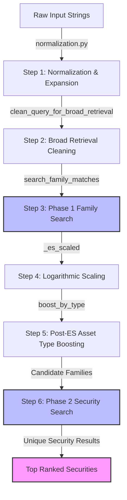

# Elasticsearch Security Mapping System

This repository implements a **dual-phase retrieval and ranking architecture** to map raw client portfolio input data to standardized master securities. It is deployed as an Azure Function App.

---

## ─── PIPELINE OVERVIEW ───

The security mapping process follows a sequential pipeline to resolve an input query (representing a family/issuer name and optionally a security description) to the best matching security in the master database.



*(Note: In the current version of the code, the custom function score blending that combined Phase 1 family score and Phase 2 match score is disabled. Phase 2 sorting is based entirely on text-matching score).*

---

## ─── PROJECT STRUCTURE ───

The core files inside [FM-SecurityMapping](file:///Users/flairmindsdev/Onpepper_Shruti/Security%20Mapping%20local/FM-SecurityMapping) include:

*   [function_app.py](file:///Users/flairmindsdev/Onpepper_Shruti/Security%20Mapping%20local/FM-SecurityMapping/function_app.py): The main Azure Function entry point handling API routing (`/api/map-security`), Elasticsearch execution, scoring scaling, and post-ES type boosting.
*   [normalization.py](file:///Users/flairmindsdev/Onpepper_Shruti/Security%20Mapping%20local/FM-SecurityMapping/normalization.py): Text preprocessing utilities, PostgreSQL-backed abbreviation expansion, and card/ordinal number conversions.
*   [config.py](file:///Users/flairmindsdev/Onpepper_Shruti/Security%20Mapping%20local/FM-SecurityMapping/config.py): Configuration dictionary structures defining boosts and thresholds.
    > [!NOTE]
    > Although configuration dictionaries are imported into `function_app.py`, the active scoring queries and boosting algorithms currently use hardcoded parameters matching these values.
*   [local.settings.json](file:///Users/flairmindsdev/Onpepper_Shruti/Security%20Mapping%20local/FM-SecurityMapping/local.settings.json): Environment configuration for local development (database credentials, ES credentials, index names).
*   [test.http](file:///Users/flairmindsdev/Onpepper_Shruti/Security%20Mapping%20local/FM-SecurityMapping/test.http): REST client test script containing sample API queries.
*   [test_all.py](file:///Users/flairmindsdev/Onpepper_Shruti/Security%20Mapping%20local/FM-SecurityMapping/test_all.py): Test suite to run validation checks.

---

## ─── 1. PRE-PROCESSING & NORMALIZATION ───

Before executing searches, input strings are preprocessed via [normalization.py](file:///Users/flairmindsdev/Onpepper_Shruti/Security%20Mapping%20local/FM-SecurityMapping/normalization.py) -> `normalize(text, conn_string)`:

1.  **Lowercasing**: The string is cast to lowercase.
2.  **Parentheses Removal**: Parentheses `()` are stripped.
3.  **Separator Normalization**: Slashes, periods, and hyphens (`/`, `.`, `-`) are replaced with spaces (e.g. `T/L` becomes `T L`).
4.  **Tokenization**: The cleaned string is split into individual tokens.
5.  **Abbreviation Expansion**: Uses `expand_tokens` with a cached PostgreSQL `abbreviation_map` (expires in 300 seconds). It matches single tokens and combines consecutive tokens (e.g., `t` + `l` $\rightarrow$ `tl`) to check against the acronym database (e.g., `tl` expands to `term loan`).
6.  **Number Translation**: Standardizes ordinal representations (e.g., `1st`, `2nd`) into full words (e.g., `first`, `second`) using `num2words`. Cardinal numbers are left untouched.
7.  **Symbol Cleaning**: Strips all non-alphanumeric/non-space symbols (`[^\w\s]`).
8.  **Stopword Stripping**: Removes generic corporate stopwords (`ltd`, `inc`, `corp`, `llc`, `lp`, `plc`, `company`, `co`, `limited`, `pvt`).

---

## ─── 2. PHASE 1: FAMILY RETRIEVAL & WEIGHTING ───

The function `search_family_matches` in [function_app.py](file:///Users/flairmindsdev/Onpepper_Shruti/Security%20Mapping%20local/FM-SecurityMapping/function_app.py) finds candidate issuer families.

### A. Broad Retrieval Cleaning
To extract the core issuer name, the normalized query is cleaned further via `clean_query_for_broad_retrieval`:
*   Strips asset-class descriptions (`"first lien"`, `"second lien"`, `"common equity"`, `"preferred equity"`, `"delayed draw term loan"`, `"term loan"`).
*   Removes extensive stop terms defined in `GENERIC_RETRIEVAL_STOPWORDS` (e.g. `holdings`, `group`, `lien`, `amendment`, `unfunded`).
*   Extracts a `primary_token` (the first token of length $\ge 3$) to serve as an anchor.

### B. Elasticsearch Family Query
The search is run against Elasticsearch using a `bool` query with a `should` clause. Results collapse on `family_name.keyword` so that only the highest-scoring security from each family is returned. Up to `MATCH_TOP_K` (default `5`) families are fetched.

#### Active Query Clauses & Boosts:

| Category | Target Field | Query String | Boost | Description |
| :--- | :--- | :--- | :--- | :--- |
| **Family Tier** | `normalized_family_name` | `cleaned_family_query` | **30** | Match phrase query |
| | `normalized_family_name` | `cleaned_family_query` | **15** | Match query (OR, `min_should_match: 50%`) |
| **SOI Tier** | `normalized_soi_name` | `cleaned_family_query` | **25** | Match phrase query |
| | `normalized_soi_name` | `cleaned_family_query` | **20** | Match query (OR, `min_should_match: 50%`) |
| **Security Tier** | `normalized_security_name` | `family_query` | **10** | Match phrase query |
| | `normalized_security_name` | `family_query` | **8** | Match query (OR) |

### C. Logarithmic Score Scaling
Raw Elasticsearch scores are scaled to a $[0.0, 1.0]$ range:

$$\text{scaled\_score} = \frac{\ln(1 + \text{raw\_score})}{\ln(1 + \text{cap})}$$

*   `cap` is configured via `ES_SCORE_LOG_CAP` (defaults to `600.0`).
*   The final scaled score is clamped between `0.0` and `1.0`.

### D. Post-ES Asset Type Boosting
The scaled score is adjusted in Python (`boost_by_type`) based on matching asset classes:
1.  Extracts the input query's asset type: `ddtl`, `tl`, `rev`, or `equity`.
2.  Concatenates the family name and the top security's name.
3.  Applies the following rules (based on the values in `ASSET_TYPE_BOOST_CONFIG`):

| Extracted Type | Target Conditions | Boost / Penalty |
| :--- | :--- | :--- |
| **ddtl** | Contains `"delayed draw"` | **+0.3** |
| | Contains `"term loan"` (but not delayed draw) | **-0.1** |
| **tl** | Contains `"term loan"` | **+0.2** |
| | Contains `"revolver"` | **-0.1** |
| **rev** | Contains `"revolver"` | **+0.2** |
| | Does not contain revolver | **-0.1** |
| **equity** | Contains `"equity"` | **+0.2** |
| | Does not contain equity | **-0.1** |

---

## ─── 3. PHASE 2: SECURITY RETRIEVAL & WEIGHTING ───

The function `search_securities_es` retrieves specific securities belonging to the matched families.

### A. Candidate Family Filtering
A hard filter (`terms` query on `normalized_family_name.keyword`) restricts candidates to families identified in Phase 1.

### B. Text Match Scoring
Evaluates how well the security records match the `security_query`:

#### Active Query Clauses & Boosts:

| Target Field | Query Type | Boost | Match Rules |
| :--- | :--- | :--- | :--- |
| `normalized_security_name` | `match_phrase` | **30** | Full phrase match |
| `normalized_security_name` | `match` | **25** | Match query (OR, `min_should_match: 50%`) |
| `normalized_soi_name` | `match` | **25** | Match query (OR, `min_should_match: 50%`) |
| `normalized_security_name`, `normalized_soi_name` | `multi_match` | **25** | Best fields match (OR, `min_should_match: 50%`) |

*Results are collapsed by `security_name.keyword` and the top 20 ranked unique securities are returned.*

### C. Commented Out/Disabled Functionality
To improve ranking accuracy or simplify execution, some features are currently commented out in `search_securities_es`:
1.  **Family Name & Security Type Tiers**: Matching on `normalized_family_name` (boost 15) and `security_type` (boost 20) are disabled.
2.  **Phase 1 Family Score Integration**: The `function_score` custom weighting that blended Phase 1 family scores into Phase 2 is disabled.
    *   **Previous Blending Formula (Disabled)**:
        $$\text{Final Score} = \text{Text Match Score} + (\text{Phase 1 Score} \times \text{FAMILY\_WEIGHT})$$
    *   **Current Active Formula**:
        $$\text{Final Score} = \text{Phase 2 Text Match Score}$$

---

## ─── API DOCUMENTATION ───

### Map Security API
*   **Endpoint**: `POST /api/map-security`
*   **Headers**: `Content-Type: application/json`

#### Request Payload
```json
{
  "input": "Events Buyer, LLC",
  "security_input": "Events buyer Term loan"
}
```

#### Response Payload
```json
{
  "input": "Events Buyer, LLC",
  "security_input": "Events buyer Term loan",
  "normalized_input": "events buyer",
  "security_normalized": "events buyer term loan",
  "matched": true,
  "cleaned_family_query": "events buyer",
  "best_family_match": {
    "family_name": "Events Buyer, LLC",
    "normalized_family_name": "events buyer",
    "top_security": "Events Buyer, LLC Initial Term Loan",
    "soi_name": "Events Buyer",
    "security_type": "Term Loan",
    "normalized_security_name": "events buyer initial term loan",
    "score": 0.582,
    "raw_es_score": 112.43,
    "security_score": 55.0
  },
  "top_matching_families": [
    {
      "family_name": "Events Buyer, LLC"
    }
  ],
  "ranked_family_securities": [
    {
      "security_name": "Events Buyer, LLC Initial Term Loan",
      "security_type": "Term Loan",
      "normalized_soi_name": "events buyer",
      "normalized_security_name": "events buyer initial term loan",
      "normalized_family_name": "events buyer",
      "score": 55.0
    }
  ]
}
```

---

## ─── LOCAL DEVELOPMENT ───

### Prerequisites
1.  **Azure Functions Core Tools** (installed via npm or brew).
2.  **Python 3.10+** (configured in virtual environment `venv`).
3.  **PostgreSQL** (running and populated with `abbreviation_map`).
4.  **Elasticsearch Instance** (running and populated with indices).

### Running the App
Start the Azure Function host:
```bash
func start
```

### Running Tests
Execute python unit tests:
```bash
python -m unittest test_all.py
```
